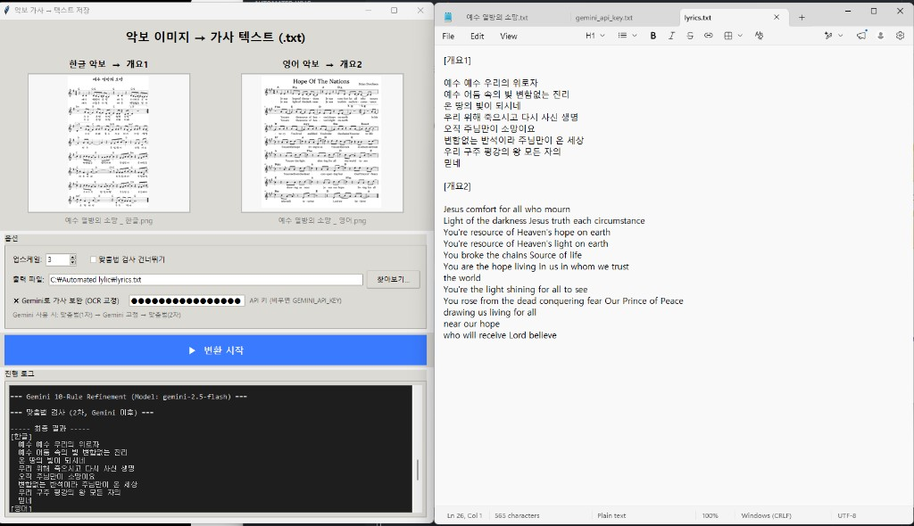
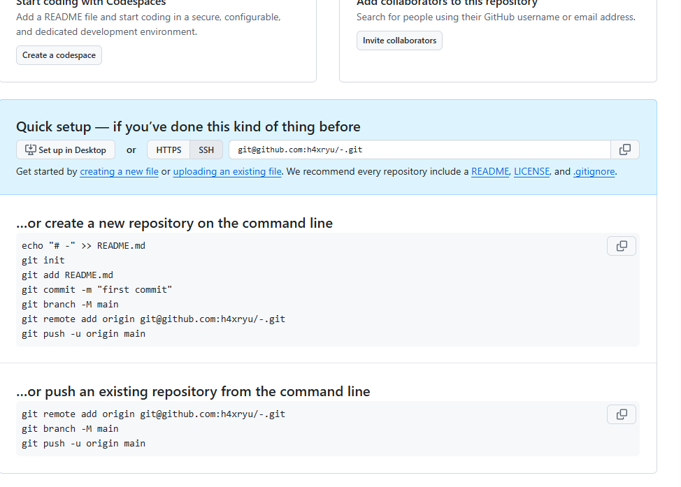

# 악보 가사 → 텍스트 (Sheet Lyrics GUI)

한글·영어 **악보 이미지(PNG/JPG)** 각 1장에서 가사를 추출해 `[개요1]` / `[개요2]` 형식 `.txt`로 저장하는 Windows GUI 도구입니다.



## 기능 (GUI에서 쓰는 것만)

| 단계 | 설명 |
|------|------|
| OCR | 업스케일(기본 3×) → 오선 검출 → 가사 영역만 EasyOCR |
| 맞춤법 1차 | `py-hanspell-aideer` / `pyspellchecker` (선택) |
| Gemini | `gemini-2.5-flash` 로 OCR 줄 교정 (선택, API 키) |
| 맞춤법 2차 | Gemini 사용 시 한 번 더 |
| 저장 | `lyrics.txt` |

## 설치

```powershell
git clone git@github.com:h4xryu/-.git
cd -
python -m pip install -r requirements.txt
```

한글 맞춤법 (Python 3.12):

```powershell
python -m pip install py-hanspell-aideer pyspellchecker
```

## 실행

```powershell
python sheelyrisgui.py
```

- 한글·영어 악보를 각각 지정 (드래그앤드롭 또는 클릭)
- **Gemini** 쓰려면 API 키 입력 또는 환경 변수 `GEMINI_API_KEY`, 프로젝트 루트 `gemini_api_key.txt` (커밋 금지)
- 모델 변경: `GEMINI_MODEL` 또는 `lyric_distill/gemini_config.py` 의 `DEFAULT_GEMINI_MODEL`

## 스크린샷 (GitHub 업로드)



## PNG → Base64 “긴 해시” 문자열

GitHub README **본문에** `data:image/png;base64,...` 를 넣으면 **보안상 렌더링이 막힐 수** 있습니다.  
대신 이 저장소에는 아래를 둡니다.

| 파일 | 용도 |
|------|------|
| [docs/images/gui-app.png](docs/images/gui-app.png) | README·웹에서 표시 (권장) |
| [docs/images/gui-app.png.b64.txt](docs/images/gui-app.png.b64.txt) | PNG를 한 줄 Base64로 변환한 텍스트 (복사·다른 도구용) |

다른 PNG도 같은 방식으로 만들기:

```powershell
python scripts/png_to_base64.py docs/images/gui-app.png --markdown
```

`--markdown` 은 로컬 HTML 미리보기용 `` 를 stdout 에 출력합니다.

## 저장소에 포함된 파일

```
sheelyrisgui.py          # GUI
sheet_lyrics_to_rtf.py  # OCR · 맞춤법 · Gemini 파이프라인
lyric_distill/          # Gemini 모델 설정, UTF-8 콘솔
docs/images/            # README 스크린샷 (+ .b64.txt)
scripts/png_to_base64.py
requirements.txt
```

오프라인 학습(Student, `run_distill.py`, `데이터셋/` 등)은 이 배포에 **포함하지 않습니다**.

## 라이선스

개인·교회 내부 사용 목적의 도구입니다. Gemini·네이버 맞춤법 API 이용 약관을 따르세요.
